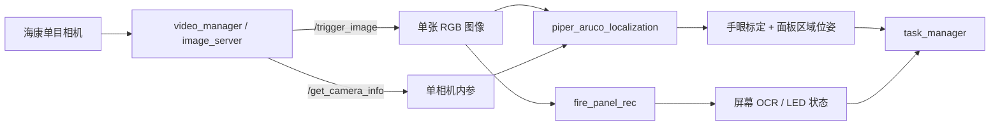

# 工控机源码择优归档（2026-09-22）

## 来源与边界

- **来源**：`ubuntu@192.168.1.165:/home/ubuntu/arm_ws/src`
- **方式**：2026-09-22 通过 SSH/SCP 只读调查与复制；未修改、删除或重启工控机上的任何内容。
- **用途**：作为当前学习项目中“单目相机 + ArUco 方形码定位 + 面板 OCR + 任务编排”的源码参考，不能直接当作当前 WSL 仿真的可编译工作区。
- **完整性记录**：[`SHA256SUMS.txt`](../reference/industrial_pc_2026-09-22/SHA256SUMS.txt) 保存所有归档文件的本地 SHA-256。

## 已归档内容

路径：[`reference/industrial_pc_2026-09-22/`](../reference/industrial_pc_2026-09-22/)

| 包 / 内容 | 对当前项目的价值 |
|---|---|
| `common_interfaces` | 消息、服务、动作的正式接口：图像触发、相机信息、面板信息、面板区域位姿、机械臂任务等。 |
| `fia_utils` | 任务工具代码。 |
| `task_manager` | 状态、任务、硬件控制与动作执行的编排实现。 |
| `fia_launch/launch` | 单目相机、ArUco、OCR 与整机集成的启动关系。 |
| `fire_panel_rec` | 面板屏幕与 LED 区域解析、单次识别节点；保留项目自定义部分。 |
| `video_manager` | 相机图像服务、图像发布及海康相机读取的项目自定义代码；包含单相机内参文件。 |
| `piper_aruco_localization` | ArUco 识别、手眼变换、面板区域配置、异常值过滤与区域位姿服务。 |

没有复制以下内容：构建/安装/日志产物、海康 MVS SDK、PaddleOCR 第三方实现、OCR 模型权重、图像样本、证书私钥，以及包含实际操作密码的任务 YAML。

本地副本另外删除了历史“复件”与 `tmp`；两处源码/说明中的内网 RTSP 地址已替换成 `rtsp://<camera-host>/...`。这些本地脱敏文件不参与远端逐字一致性断言。

## 当前单目链路（源码证据）

`single_shot_rec_node.cpp` 将 `/trigger_image` 的结果按 `RGB8` 转为 OpenCV 图像处理。`single_shot_detector.cpp` 同样通过图像和相机信息服务获取单帧数据，再用 ArUco 标记、面板 YAML 与手眼标定计算位姿。因此，当前消防面板链路有明确的**单目采集证据**。

活动启动参考 `piper_perception_launch.py` 选择：

- 图像未预先矫正：`image_is_rectified=false`
- 主标记：ID `582`
- 标记边长：`0.04 m`
- 手眼标定：`piper_hk_eih_33.calib`
- 面板定义：`aruco_panel_new.yaml`

`hk_ost.yaml` 记录的分辨率为 `1280×1024`、`plumb_bob` 畸变模型及单相机内参。它的 `camera_name: narrow_stereo` 只是文件中的名称；当前调用链没有读取左/右图像对，也没有视差或深度话题，不能据此认定现有系统已实现双目。

## 双目优化可以继承什么

双目适合在现有链路前增加“同步图像对 → 标定/矫正 → 视差/深度”的层：

1. 保留 `task_manager`、面板 OCR 和现有 ArUco 服务作为任务接口。
2. 让左目矫正图继续提供 OCR 与 ArUco 检测，保持已有业务逻辑。
3. 新增同步的左/右 `Image + CameraInfo`、双目标定与矫正，并发布视差或深度。
4. 用深度补足面板、按钮或机械臂目标的距离估计；与现有手眼变换一起输出三维目标位姿。

## 目前不能从单目源码推断的内容

下列参数必须在选定双目硬件后重新测量或标定，不能从当前工程合理推出：双目基线、左右相机外参、两路时间同步方式、曝光/增益一致性、视差范围、有效深度范围与误差、镜头型号和安装位置。

工控机其他工作区里存在 Astra 深度相机和通用 `stereo_image_proc` 相关文件，但尚未发现它们接入上述消防面板识别链路的证据；本次没有把这些第三方或旁路工程混入参考副本。

## 校验结论

对接口、启动、识别、相机服务、标定与 ArUco 配置等 13 个关键锚点文件，已在工控机与本地分别计算 SHA-256，结果一致。完整本地文件数为 102（其中 `SHA256SUMS.txt` 为本地生成的清单），归档内容约 0.4 MB。

这证明复制的未脱敏锚点没有在传输中改变；不证明它能在当前 WSL 中直接编译或驱动真实硬件，原因是本次刻意没有归档模型、厂商 SDK、设备参数和整套依赖。
