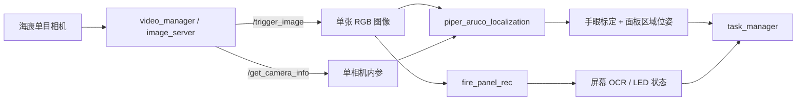

# 工控机源码择优归档（2026-09-22，补全复核版）

## 来源与边界

- **来源**：`ubuntu@192.168.1.165:/home/ubuntu/arm_ws/src`（视觉、机械臂、任务）及 `/home/ubuntu/yuhuo_ws/src`（实体底盘、传感器、导航）。
- **方式**：2026-09-22 通过 SSH/SCP 只读调查与复制；未修改、删除或重启工控机上的任何内容。
- **用途**：作为当前学习项目的论文复现材料，覆盖“底盘/传感器 → 建图定位导航 → 到点任务 → 单目 ArUco 定位 → OCR/LED 识别 → 机械臂/升降执行”。它仍不能直接当作当前 WSL 仿真的可编译工作区。
- **完整性记录**：[`SHA256SUMS.txt`](../reference/industrial_pc_2026-09-22/SHA256SUMS.txt) 保存所有归档文件的本地 SHA-256。

## 已归档内容

路径：[`reference/industrial_pc_2026-09-22/`](../reference/industrial_pc_2026-09-22/)

| 包 / 内容 | 对当前项目的价值 |
|---|---|
| `common_interfaces` | 消息、服务、动作的正式接口：图像触发、相机信息、面板信息、面板区域位姿、机械臂任务等。 |
| `fia_utils` | 任务工具代码。 |
| `task_manager` | 状态、任务、硬件控制与动作执行的编排实现。 |
| `fia_launch/launch` | 单目相机、ArUco、OCR 与整机集成的启动关系。 |
| `fire_panel_rec` | 面板屏幕与 LED 区域解析、单次识别节点；保留项目自定义部分。 |
| `video_manager` | 相机图像服务、图像发布及海康相机读取的项目自定义代码；包含单相机内参文件。 |
| `piper_aruco_localization` | ArUco 识别、手眼变换、面板区域配置、异常值过滤与区域位姿服务。 |
| `aruco` | `piper_aruco_localization` 编译所依赖的 ArUco 5.0.5 源码。 |
| `piper_arm` | Piper 驱动、描述、URDF/Xacro、MoveIt 配置与仿真相关包。 |
| `lift_control`、`robot_state_pub` | 升降平台控制及机器人状态发布实现。 |
| `wheeltec_nav2`、`fia_robot_nav2` | 实体底盘的 Nav2 参数、地图、AMCL/导航启动和多点巡航关联。 |
| `fia_robot`、`lslidar_driver`、`twist_mux` | WheelTec 底盘、N10P 雷达、传感器启动和速度命令仲裁。 |
| `astra_camera`、`nav2_waypoint_cycle` | 论文下层深度避障用的 Astra 驱动，以及多点导航循环节点。 |
| `fire_panel_rec/models`、`src/include/ppocr`、`3rdparty` | PP-OCR 检测、识别、分类模型及其项目内推理代码。 |
| `video_manager/3rdparty/MVS` | 海康 MVS 头文件和 Linux x64 运行库，版本线索为 `4.5.0.3`。 |
| `stereo_reference/visual_slam_start.py` | 另一个 WheelTec 工程里的通用双目处理示例，仅作接口参考。 |

没有复制以下内容：构建/安装/日志产物、相机样本图像、证书私钥及其他证书文件。已复制运行所需的海康 MVS 运行库、OCR 代码和模型权重；任务 YAML 只保留经脱敏的 `task_config_v2.yaml`。

本地副本删除了历史“复件”与 `tmp`；两处源码/说明中的内网 RTSP 地址已替换成 `rtsp://<camera-host>/...`，任务 YAML 中的密码值替换为 `<redacted>`。这些本地脱敏文件不参与远端逐字一致性断言。

## 当前单目链路（源码证据）

`single_shot_rec_node.cpp` 将 `/trigger_image` 的结果按 `RGB8` 转为 OpenCV 图像处理。`single_shot_detector.cpp` 同样通过图像和相机信息服务获取单帧数据，再用 ArUco 标记、面板 YAML 与手眼标定计算位姿。因此，当前消防面板链路有明确的**单目采集证据**。

活动启动参考 `piper_perception_launch.py` 选择：

- 图像未预先矫正：`image_is_rectified=false`
- 主标记：ID `582`
- 标记边长：`0.04 m`
- 手眼标定：`piper_hk_eih_33.calib`
- 面板定义：`aruco_panel_new.yaml`

`hk_ost.yaml` 记录的分辨率为 `1280×1024`、`plumb_bob` 畸变模型及单相机内参。它的 `camera_name: narrow_stereo` 只是文件中的名称；当前调用链没有读取左/右图像对，也没有视差或深度话题，不能据此认定现有系统已实现双目。

## 双目优化可以继承什么

双目适合在现有链路前增加“同步图像对 → 标定/矫正 → 视差/深度”的层：

1. 保留 `task_manager`、面板 OCR 和现有 ArUco 服务作为任务接口。
2. 让左目矫正图继续提供 OCR 与 ArUco 检测，保持已有业务逻辑。
3. 新增同步的左/右 `Image + CameraInfo`、双目标定与矫正，并发布视差或深度。
4. 用深度补足面板、按钮或机械臂目标的距离估计；与现有手眼变换一起输出三维目标位姿。

归档的 `stereo_reference/visual_slam_start.py` 给出了 ROS2 接口骨架：左右 `Image + CameraInfo` 经 `image_proc` 矫正，`stereo_image_proc` 产生视差和点云，RTAB-Map 可消费左右矫正图。它来自另一套 WheelTec RRT/视觉 SLAM 工程，且工控机环境中 `image_proc`、`stereo_image_proc` 均未发现已安装版本，因此它是**未验证参考**，不能直接接入消防面板链路。

## 目前不能从单目源码推断的内容

下列参数必须在选定双目硬件后重新测量或标定，不能从当前工程合理推出：双目基线、左右相机外参、两路时间同步方式、曝光/增益一致性、视差范围、有效深度范围与误差、镜头型号和安装位置。

论文使用的 Astra 是下层避障的 RGB-D/深度相机，已归档其驱动；它不等同于计划中的双目视觉改造。仍未发现双目处理已接入上述消防面板识别链路的证据。

## 可运行条件与剩余缺口

本归档现在足以作为**论文工程源码与运行材料的参考副本**，但不等同于可立即启动的实体系统。至少仍需要：对应 Ubuntu/ROS2 版本、OpenCV/OpenVINO/gflags、MoveIt2/Nav2/SLAM Toolbox、相机与底盘实际设备、USB/CAN/串口权限、网络地址，以及针对真实安装姿态重新完成相机内参与手眼标定。

工控机的 `/opt/ros/humble` 已验证存在 MoveIt2、Nav2、SLAM Toolbox 与 RTAB-Map；未发现 `easy_handeye2`、`aruco_ros`、`image_proc`、`stereo_image_proc`。当前运行源码能读取既有的手眼标定文件并使用随工程保存的 ArUco 库，但若要**重新执行论文的标定流程**，仍要安装或另行保存 `easy_handeye2` 与 `aruco_ros`；若要做双目，还要安装 `image_pipeline` / `stereo_image_proc`，并配合选定硬件重新标定。

## 校验结论

对首轮视觉链路的 13 个锚点及补全后的 12 个锚点（机械臂、底盘、雷达、深度相机、导航、MVS 头文件、OCR 模型、双目参考）均在工控机与本地分别计算 SHA-256，结果一致。`SHA256SUMS.txt` 当前列出 2,633 个归档内容文件；参考目录连同该清单共有 2,634 个文件、约 124.5 MB。

这证明复制的未脱敏锚点没有在传输中改变；不证明它能在当前 WSL 中直接编译或驱动真实硬件，原因是设备、系统依赖和标定结果仍有环境绑定关系。
